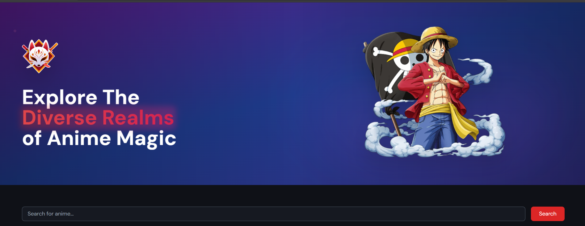
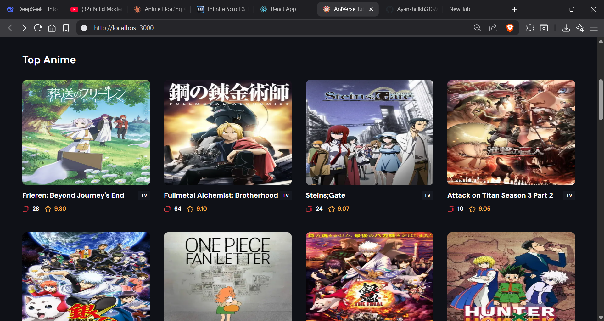
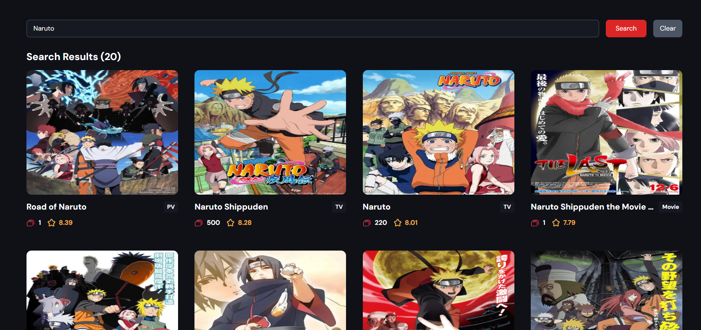

#  AniVerseHub

**Your Gateway to Infinite Anime Worlds** | [Live Demo](#) | [Report Bug](#) | [Request Feature](#)



## 🚀 Features

<div align="center">
  
   
</div>

- **10,000+ Anime Library** - From classics to new releases
- **Personalized Recommendations** - AI-powered suggestions

## 🖥️ Screenshots

| Home Page                      | Anime Details                   |
| ------------------------------ | ------------------------------- |
|  |  |

## 🛠️ Tech Stack


## 📦 Installation

1. Clone the repository:

```bash
git clone https://github.com/Ayanshaikh313/AniVerseHub.git
cd AniVerseHub
```

2. Install dependencies:

```bash
npm install
```

3. Start the development server:

```bash
npm run dev
```
